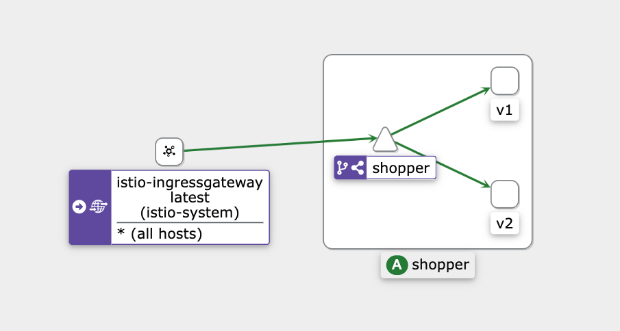
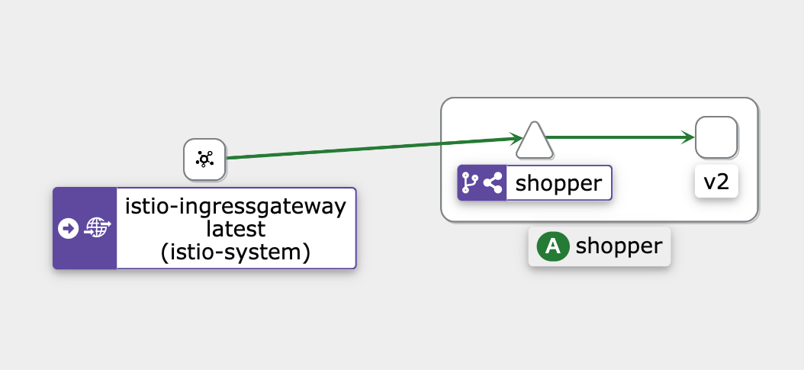

# Terminal 20 - Istio canary release
Shopper microservice orchestrated with K8s and Istio

## What is canary release?
Canary release is an advanced deployment strategy which allow to gradually introduce a new version of a service by routing a small
percentage of the traffic in the first stage and then if all goes well, increase the percentage until the traffic is entirely routed to the new version of the service.

There are other deployment strategies like Blue-Green and A/B Testing used for different purposes.

## Why Istio?
Container orchestration platforms like Kubernetes only support traffic distribution based on instance scaling,
whereas Istio extends these capabilities and can split the traffic between two or more services based on:
- percentages
- user subsets

There are other solutions which enable similar capabilities like **Route** on Openshift.

## Service graph Kiali



In the K8s namespace called *t20* we have:
 - istio ingress controller
 - shopper service v1
 - shopper service v2

## 1.0 vs 2.0
Both services expose an endpoint ``http://localhost:8080/shops/`` which return a list of shops. The first version
return 3 shops and the newer version s one more shop with a new field called *category* as shown below:

### Shops 1.0
```json
[
    {
        "id": "AQSW165",
        "email": "home@shop.it",
        "tel": "07851123456",
        "address": "Science Park, 270 Milton Rd, Milton, Cambridge CB4 0WE"
    },
    {
        "id": "WEDD321",
        "email": "sport@shop.it",
        "tel": "07851123456",
        "address": "Science Park, 270 Milton Rd, Milton, Cambridge CB4 0WE"
    },
    {
        "id": "OTDD422",
        "email": "cat@shop.it",
        "tel": "07851123456",
        "address": "Science Park, 270 Milton Rd, Milton, Cambridge CB4 0WE"
    }
]
```

### Shop 2.0
```json
[
    {
        "id": "RST1656",
        "email": "restaurant@shop.it",
        "tel": "07851123456",
        "address": "Science Park, 270 Milton Rd, Milton, Cambridge CB4 0WE",
        "category": "Food"
    },
    {
        "id": "AQSW165",
        "email": "home@shop.it",
        "tel": "07851123456",
        "address": "Science Park, 270 Milton Rd, Milton, Cambridge CB4 0WE",
        "category": null
    },
    {
        "id": "WEDD321",
        "email": "sport@shop.it",
        "tel": "07851123456",
        "address": "Science Park, 270 Milton Rd, Milton, Cambridge CB4 0WE",
        "category": null
    },
    {
        "id": "OTDD422",
        "email": "cat@shop.it",
        "tel": "07851123456",
        "address": "Science Park, 270 Milton Rd, Milton, Cambridge CB4 0WE",
        "category": null
    }
]
```

## Set up a local environment

### Prerequisites
- Java 17
- Docker
- Minikube

### Create the 2 versions of the Shopper service

Create and push the 2 versions (1.0 and 2.0) in the local container registry following these steps:
- run the git command to switch to the old version: ``git checkout <version>``
- build a Docker image with Jib and push to the local container register using the following command: `` ./gradlew jibDockerBuild ``
- run this command to check the images are present: ``docker images | grep shopper``
- load the image into Minikube with the command: `` minikube image load shopper:<version> ``

### Create k8s cluster locally and deploy the shopper 1.0

Follow these steps will create a new namespace with istio injection enabled and a deployment with 2 replicas of the shopper service:

- deploy the application in your local k8s, go to `/k8s-manifest` folder and run
    - `` kubectl apply -f deployment.yaml ``
- check if everything is running with the command `` kubectl get all -n t20 ``. You should be able to see the following Kubernetes resources:
```shell
NAME                          READY   STATUS    RESTARTS   AGE
pod/shopper-dd77664c8-7jdtc   2/2     Running   0          32s
pod/shopper-dd77664c8-fsfpp   2/2     Running   0          32s

NAME              TYPE        CLUSTER-IP     EXTERNAL-IP   PORT(S)    AGE
service/shopper   ClusterIP   10.100.51.53   <none>        8080/TCP   33s

NAME                      READY   UP-TO-DATE   AVAILABLE   AGE
deployment.apps/shopper   2/2     2            2           33s

NAME                                DESIRED   CURRENT   READY   AGE
replicaset.apps/shopper-dd77664c8   2         2         2       33s
```

### Deploy the shopper 2.0

 - deploy the shopper service 2.0 with the command `` kubectl apply -f deploymentV2.yaml ``
-  check the version are up with the command `` kubectl get all -n t20 ``. You might wait some time before all are up and running. At the end you should be able to see the following Kubernetes resources:
```shell
NAME                             READY   STATUS    RESTARTS   AGE
pod/shopper-846c894568-8n7px     2/2     Running   0          31m
pod/shopper-846c894568-xqp26     2/2     Running   0          31m
pod/shopperv2-776c9d4cd8-h69zc   2/2     Running   0          31s
pod/shopperv2-776c9d4cd8-n8pf6   2/2     Running   0          31s

NAME              TYPE        CLUSTER-IP    EXTERNAL-IP   PORT(S)    AGE
service/shopper   ClusterIP   10.96.1.131   <none>        8080/TCP   24h

NAME                        READY   UP-TO-DATE   AVAILABLE   AGE
deployment.apps/shopper     2/2     2            2           24h
deployment.apps/shopperv2   2/2     2            2           32s

NAME                                   DESIRED   CURRENT   READY   AGE
replicaset.apps/shopper-846c894568     2         2         2       24h
replicaset.apps/shopperv2-776c9d4cd8   2         2         2       31s

```

### Install the Istio resources:

Install the following Istio custom resources:
- `` kubectl apply -f virtual-service.yaml ``
- `` kubectl apply -f destination-rule.yaml ``
- `` kubectl apply -f gateway.yaml ``

Check if everything is up and running: ``kubectl get gateway,virtualservices,destinationrule -n t20``

### Test the traffic routing between the 2 services

The logic how the traffic is routed between the 2 versions are defined in the files: [*virtual-service.yaml*](k8s-manifests/virtual-service.yaml) and [*destination-rule.yaml*](k8s-manifests/destination-rule.yaml):

The Destination Rule defines the service versions and the Virtual Service defines the route rules.

- run this command multiple times to ask the service the list of the shops: ``curl -m 2 http://localhost:8080/shops/``.
- Since we configured in the Virtual service to split the traffic 50% to the shopper V1 and 50% to the shopper V2
you should notice you'll get the 2 different responses: [v1](#Shops 1.0) and [v2](#Shop 2.0).
- start Kiali with the command ``istioctl dashboard kiali`` and check the traffic routing in the graph


## Move all the traffic to the Shopper v2
Let's switch all the traffic to the Shopper v2:

- modify the [*virtual-service.yaml*](k8s-manifests/virtual-service.yaml) file in this way:

```yaml
  http:
    - route:
        - destination:
            host: shopper
            port:
              number: 8080
            subset: v1
          weight: 0
        - destination:
            host: shopper
            port:
              number: 8080
            subset: v2
          weight: 100
```
- apply this change to the cluster with the command ```kubectl apply -f virtual-service.yaml ```
- run the *curl* command multiple times to check we are getting only the response from the shopper v2: ``curl -m 2 http://localhost:8080/shops/``.
- You should also see in the Kiali dashboard that the traffic is only routed to the version 2.0:


## Next?
[Route based on user identity](https://istio.io/latest/docs/tasks/traffic-management/request-routing/#route-based-on-user-identity)
